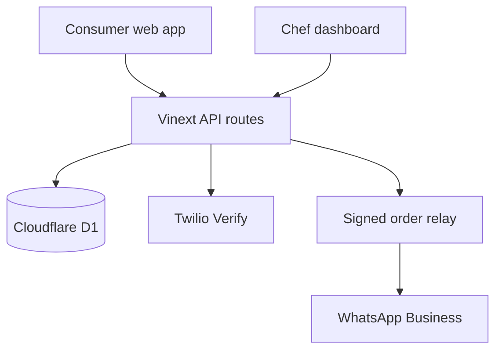

# Sahana Bhakshanam — Product and Technical Specification

## 1. Product boundary

This is a dedicated application for one chef and one kitchen—not a marketplace. There are only two roles:

- **Consumer:** verifies a mobile number, sees today’s available dishes, orders within a valid session, and pays at delivery.
- **Chef:** signs in using the allowlisted chef mobile number, manages availability and portions, sees orders immediately, and maintains the public kitchen profile.

The application never holds money, runs a payment gateway, allocates delivery partners, or allows a chef to override a closed cutoff.

Sahana Bhakshanam is a pure vegetarian Tamil Brahmin Iyer home-food business. Pure vegetarian is enforced as a server-side invariant: public queries exclude legacy non-vegetarian records, new specials are always vegetarian, and checkout rejects any item that is not marked vegetarian.

## 2. Functional specification

### Authentication

1. The customer submits a valid Indian mobile number.
2. The server rate-limits requests to three OTPs per ten minutes per number.
3. Twilio Verify sends and validates the production OTP. The app never stores a plaintext production OTP.
4. A successful verification creates an opaque random session token. Only its SHA-256 hash is stored in D1.
5. The browser receives an `HttpOnly`, `SameSite=Strict`, `Secure` cookie with a seven-day expiry.
6. Chef login uses the same flow, but the normalized number must appear in the hosted `CHEF_PHONE_E164` / `CHEF_PHONE_E164_LIST` allowlist; authorization is enforced again on every admin API and existing chef sessions are revoked when their number leaves the allowlist.
7. A visibly labelled fixed OTP exists only in explicit prototype mode.

### Fixed meal sessions

| Session | Order opens | Hard cutoff | Delivery window |
|---|---:|---:|---:|
| Breakfast | Previous day, 6:00 PM | 7:00 AM | 7:30–9:30 AM |
| Lunch | 8:00 AM | 11:00 AM | 12:30–2:00 PM |
| Evening snacks | 12:00 PM | 4:00 PM | 4:30–6:00 PM |
| Dinner | 3:00 PM | 7:30 PM | 7:30–9:30 PM |

- All calculations use Asia/Kolkata time.
- The client updates its countdown every second with tabular digits.
- The server independently recomputes the window when an order is confirmed. Changing the device clock cannot bypass a cutoff.
- The chef may mark a session unavailable, but cannot move its opening time, cutoff, or delivery window through the dashboard.
- When a cutoff is reached, add buttons lock and the API returns `409 Conflict` for any stale client.

### Menu and stock

- The chef can add a special, assign it to one meal, set price and initial portions, toggle availability, and adjust remaining portions.
- Order confirmation re-reads authoritative item prices, meal assignment, availability, and remaining stock from D1.
- The server calculates the total; client totals are presentational only.
- Confirmation decrements portions and writes the order and line items in one D1 batch.

### Ordering and payment

1. Customer adds dishes that belong to an open session.
2. Mobile verification is required before checkout.
3. Customer provides name, complete address, optional landmark, and preferred doorstep payment method.
4. The only payment methods are `cash` and `direct UPI at delivery`.
5. There is no card form, UPI collect request, QR payment inside checkout, deposit, payment link, or gateway SDK.
6. Confirmation repeats the amount and explicitly says that nothing has been paid.

### Instant chef notification

Every confirmed order is written to D1 first. That write is the source of truth and makes the order available to the chef’s direct order queue immediately.

The notification bridge then records two independently observable events:

- `dashboard / sent` — the chef’s in-app queue can display the order.
- `whatsapp / sent | needs_setup | failed` — delivery through the configured signed relay.

`ORDER_RELAY_URL` receives an HMAC-SHA256 signed payload in `X-SB-Signature`. The relay can be implemented with WhatsApp Business Cloud API or an approved BSP. If it is missing or fails, the order is not lost and the dashboard remains authoritative.

Important limitation: a personal WhatsApp account cannot receive an automatic server-generated message through a `wa.me` deep link. Deep links require a human to tap Send. Production auto-delivery therefore requires WhatsApp Business onboarding, user consent, and any required approved message templates.

## 3. Architecture

- **UI:** React 19, Next-compatible App Router components, Vinext, responsive CSS, locally bundled Fraunces and Manrope fonts.
- **Runtime:** Cloudflare Worker-compatible ESM output.
- **Persistence:** Cloudflare D1 with Drizzle schema and generated SQL migrations.
- **Images:** local optimized WebP assets; no runtime image optimizer dependency.
- **Time authority:** server UTC clock converted to the fixed India offset for window checks.

## 4. Data model

| Table | Purpose |
|---|---|
| `users` | Normalized phone identity and role |
| `otp_challenges` | Rate limits, provider reference, attempts, expiry, single use |
| `sessions` | Hashed opaque session token and expiry |
| `chef_profiles` | Public kitchen, chef, locality, WhatsApp, and UPI-at-door details |
| `meal_slots` | Fixed labels and availability switch |
| `menu_items` | Daily dish, authoritative price, meal, portions, availability |
| `orders` | Customer, address, meal, total, doorstep method, lifecycle status |
| `order_items` | Immutable order line snapshot |
| `notification_events` | Dashboard and WhatsApp delivery audit trail |

## 5. API contract

| Method and route | Auth | Responsibility |
|---|---|---|
| `POST /api/auth/request-otp` | Public + rate limit | Start consumer or chef OTP |
| `POST /api/auth/verify-otp` | Challenge | Verify once and create secure session |
| `GET /api/auth/me` | Session | Restore signed-in UI state |
| `POST /api/auth/logout` | Session | Expire browser session |
| `GET /api/store` | Public | Kitchen profile, slots, and current menu |
| `POST /api/orders` | Consumer | Revalidate cutoff/stock, create order, notify chef |
| `GET/PATCH/POST /api/admin/menu` | Chef | Read, update, and add specials |
| `PATCH /api/admin/slots` | Chef | Toggle only availability; reject cutoff edits |
| `GET/PATCH /api/admin/orders` | Chef | Poll direct order queue and update lifecycle |
| `PUT /api/admin/profile` | Chef | Update public kitchen and delivery details |

## 6. Security and operational controls

- OTP challenge expires in five minutes and locks after five incorrect attempts.
- OTP request throttling is persisted, not held in process memory.
- Session tokens are random, non-guessable, hashed at rest, and stored in HttpOnly cookies.
- Admin authorization is server-side on every write.
- All SQL uses prepared statements and bound values.
- Order totals and time windows are never trusted from the browser.
- Relay payloads are signed; relay failures are audited and do not roll back a valid order.
- Phone and address are intentionally visible only to the chef order queue and notification bridge.
- Logs must redact OTPs, session tokens, full customer phone numbers, and delivery addresses.

## 7. Production activation checklist

1. Confirm the delivery locality, dishes, prices, chef mobile, WhatsApp Business number, and UPI ID.
2. Set `OTP_DEMO_MODE=false`.
3. Configure `OTP_HASH_SECRET`, the three Twilio Verify secrets, and the hosted chef phone allowlist.
4. Connect and verify the signed WhatsApp Business relay.
5. Make the site public only after testing consent copy, privacy policy, refund/cancellation policy, FSSAI/GST applicability, service radius, and order load limits.
6. Add monitoring for OTP provider failures, cutoff rejection spikes, relay failures, and orders remaining in `new` state.

## 8. Deliberate non-goals

- Multi-chef marketplace
- Online payment collection
- Variable/on-demand delivery slots
- Delivery-partner tracking
- Coupons, loyalty, subscriptions, or ratings
- Silent automation of a personal WhatsApp account
